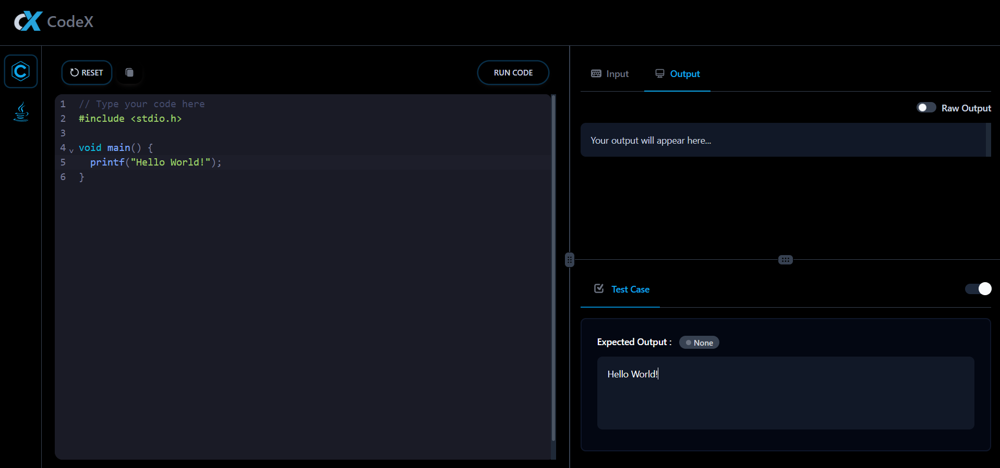

# Codex Online Compiler (Frontend)

An intuitive and user-friendly online compiler tailored for developers working with C and Java. Codex enhances the debugging and testing experience by providing real-time code execution, raw output visibility, and custom test case support—all within a responsive and sleek UI.

🌐 Live Site: [https://projectspro.site/sanjith/codex](https://projectspro.site/sanjith/codex)

---

## Demo

---

## 🧩 About the Project

Developers often face limitations when trying to view raw outputs or test custom cases in traditional compilers. Codex was created to address these challenges, making coding, testing, and debugging more seamless and accessible directly from the browser.

---

### ✨ Key Features

- **Multi-language Support**: Compile and run code in **C** and **Java**.
- **Custom Test Cases**: Input your own test data to validate outputs.
- **Raw Output Visibility**: View unformatted output for precise debugging.
- **Syntax Highlighting**: Readable and structured code display for easier development.
- **Input/Output Editors**: User-friendly panes for entering inputs and viewing results.
- **Real-time Execution Panel**: Instantly see execution results in an interactive output console.

---

### 👨‍💻 Tech Stack

- **Frontend Framework**: React.js
- **State Management**: Redux
- **Styling**: Tailwind CSS

---
